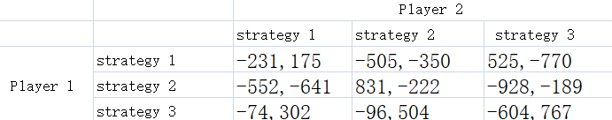
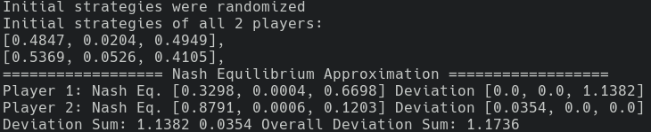
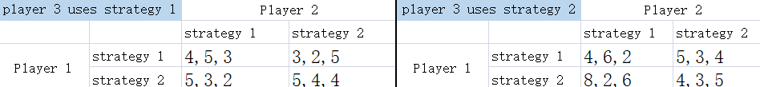
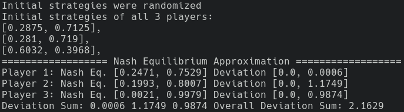
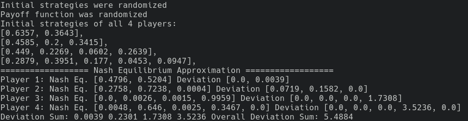
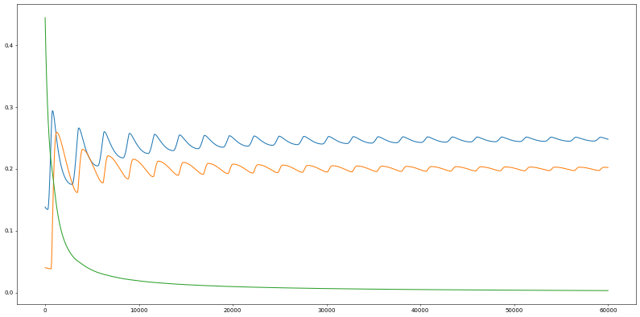
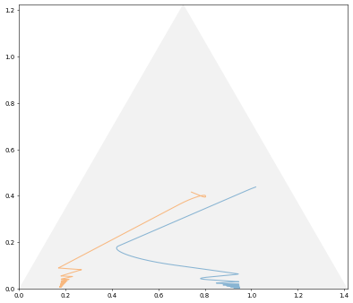
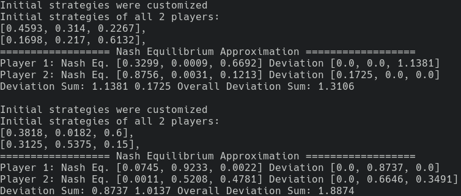

# Find Nash equilibrium for all games

This program helps to find Nash equilibrium (NE) for any type of games.
It is especially useful for those games with more than two players,
which oftentimes are unsolvable.

The program has an algorithm called [GRM](https://doi.org/10.1063/5.0012735) playing behind the scenes,
and requires Python and its packages such as `numpy` and `matplotlib` to run.

Following are some examples on how to use this program.

## Example 1: find NE for two-person games
Usually a two-persons matrix game is defined by the bimatrix, as follows:



[example\_2p.py](./example_2p.py) shows how to convert this bimatrix into Python code,
so that we can run `python example_2p.py` to find an NE.
```python
# example_2p.py
import grm
game = grm.Game()
# two playeys, and each player uses THREE pure strategies
game.player_join(grm.Player(3))
game.player_join(grm.Player(3))
game.player_init_mixed_strategies()
# assign the payoff (define the payoff function)
# player 1
game.player_assign_payoff(1, "11", -231)
game.player_assign_payoff(1, "12", -505)
game.player_assign_payoff(1, "13", 525)
game.player_assign_payoff(1, "21", -552)
game.player_assign_payoff(1, "22", 831)
game.player_assign_payoff(1, "23", -928)
game.player_assign_payoff(1, "31", -74)
game.player_assign_payoff(1, "32", -96)
game.player_assign_payoff(1, "33", -604)
# player 2
game.player_assign_payoff(2, "11", 175)
game.player_assign_payoff(2, "12", -350)
game.player_assign_payoff(2, "13", -770)
game.player_assign_payoff(2, "21", -641)
game.player_assign_payoff(2, "22", -222)
game.player_assign_payoff(2, "23", -189)
game.player_assign_payoff(2, "31", 302)
game.player_assign_payoff(2, "32", 504)
game.player_assign_payoff(2, "33", 767)
# run the iterations to approximate Nash equilibrium
game.run(iterations=10**5)
```
In this code, first and foremost,
each payoff value in the bimatrix is one-to-one written
as a call to the `player_assign_payoff` method, which takes three parameters.
The first parameter is player index, which starts from 1 as normal people will do.
The second, by taking "13" for example,
means that player 1 takes strategy 1 and player 2 takes strategy 3.
The third one is payoff value.

Inside the program, the GRM algorithm works in the iterative way.
And given any initial strategy, the iterations will always evolve to an NE.
Therefore, `player_init_mixed_strategies` method
must be called to initialized strategies.
In this code, the method is called without any parameter,
meaning that strategies are initialized randomly.

Running the code with `python example_2p.py`, we will see the following output:



In this output, we can see the approximate of NE,
whose accuracy can be evaluated by the deviation statistics.
Smaller deviation is better, indicating the approximate is near the true equilibrium point.


## Example 2: find NE for three-person games

Below is the form of three-person game we see a lot in the textbook. In this game, each player uses two pure strategies.



Like the two-person game, in [example\_3p.py](./example_3p.py) these two matrices are written as `player_assign_payoff` method calls:
```python
# assign the payoff (define the payoff function)
# player 1
# left matrix
game.player_assign_payoff(1, "111", 4)
game.player_assign_payoff(1, "121", 3)
game.player_assign_payoff(1, "211", 5)
game.player_assign_payoff(1, "221", 5)
# right matrix
game.player_assign_payoff(1, "112", 4)
game.player_assign_payoff(1, "122", 5)
game.player_assign_payoff(1, "212", 8)
game.player_assign_payoff(1, "222", 4)
# player 2
# left matrix
game.player_assign_payoff(2, "111", 5)
game.player_assign_payoff(2, "121", 2)
game.player_assign_payoff(2, "211", 3)
game.player_assign_payoff(2, "221", 4)
# right matrix
game.player_assign_payoff(2, "112", 6)
game.player_assign_payoff(2, "122", 3)
game.player_assign_payoff(2, "212", 2)
game.player_assign_payoff(2, "222", 3)
# player 3
# left matrix
game.player_assign_payoff(3, "111", 3)
game.player_assign_payoff(3, "121", 5)
game.player_assign_payoff(3, "211", 2)
game.player_assign_payoff(3, "221", 4)
# right matrix
game.player_assign_payoff(3, "112", 2)
game.player_assign_payoff(3, "122", 4)
game.player_assign_payoff(3, "212", 6)
game.player_assign_payoff(3, "222", 5)
```

Running `python example_3p.py`, we have:



## Example 3: find NE for any many-person game
What this program really shines for is, it can handle any general n-person game
where players can uses any number of pure strategies.
The following example is a four-person game, as defined in [example\_np.py](./example_np.py).
In this game, there are supposed to be *2\*3\*4\*5=120* `player_assign_payoff` method calls,
which are so overwhelming that we have to make one `player_assign_random_payoff` method call,
which will randomize the payoff functions for all players.

```python
import grm
game = grm.Game()
# four palyers, and each uses two, three, four and five pure strategies
game.player_join(grm.Player(2))
game.player_join(grm.Player(3))
game.player_join(grm.Player(4))
game.player_join(grm.Player(5))
game.player_init_mixed_strategies()
# assign the payoff (define the payoff function)
game.player_assign_random_payoff()
game.run()
```

Running `python example_np.py`, we have:



## Example 4: visulizations of approximation
For any game where all players use two pure strategies,
we can call `plot_2()` method to draw the trajectories of strategy approximation.
For `Example 2`, by running `python example_3p.py`, we have the diagram output:



For any game where all players use three pure strategies,
we can call `plot_3()` method to draw the trajectories.
For `Example 1`, by running `python example_2p.py`, we have:



These diagrams show clearly the games coverge torwards NEs.

**TBD** For any game where players use more than three pure strategies,
their strategy trajectories can be drawn after reducing the strategies' dimensions with PCA method.

## Example 5: different initial strategies go to different NEs
As mentioned, given any initial strategy, the GRM algorithm will converge the game to one NE.
However, given different initial strategies, the convergence might go to different NEs if the game has more than one NE.
The following code in [example\_2p\_explore.py](./example_2p_explore.py) and its output show how initial strategies
affect the convergence towards NEs, by taking the bimatrix in `Example 1`.
```python
init_strategy_1 = [
    [0.4593, 0.314, 0.2267],
    [0.1698, 0.217, 0.6132],
]
init_strategy_2 = [
    [0.3818, 0.0182, 0.6],
    [0.3125, 0.5375, 0.15],
]
game.player_init_mixed_strategies(init_strategy_1)
game.run()
print()
game.player_init_mixed_strategies(init_strategy_2)
game.run()
```


A trick is, we can manipulate or simply randomize initial strategy to explore NEs.
```python
while True:  # brutal
    game.player_init_mixed_strategies()
    game.run()
```

## Limitations
- Despite the name "finder", the program provides the approximates of NEs rather than the exact solutions.
***What is worse***, the approximation oftentimes suffers from terrible accuracy due to
[the cyclic path issue](https://github.com/lansiz/eqpt#important-the-cyclic-strategy-path-issue),
whose three-pure-strategy case can be demonstrated by running `python example_2p_RPS_Shapley.py`.

- Try as we may with manipulating initial strategy, the exploring for NEs could be in-exhaustive.

- It could take centuries for the program compute for big games,
due to its lack of parallel computing and the time complexity of GRM algorithm.

- Players cannot use more than nine pure strategies.
To use more pure strategies, please visit [this project](https://github.com/lansiz).

